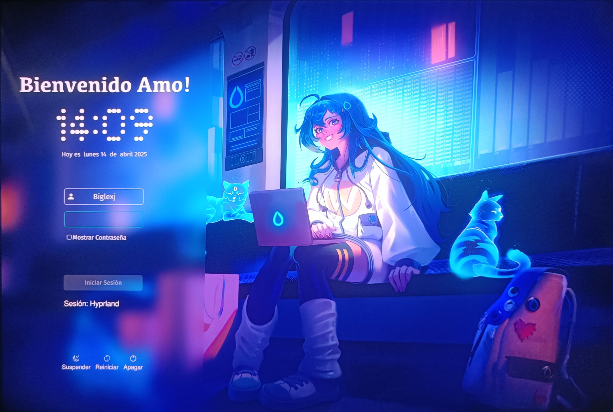

# hypr-ely-neon Theme SDDM

Un tema personalizado para SDDM (Simple Desktop Display Manager) con un diseño moderno y minimalista.



## 🔗 Repositorios y Recursos

### Repositorios
- **GitHub**: [biglexj/hypr-ely-neon](https://github.com/biglexj/hypr-ely-neon.git)

### Fuentes Requeridas
| Fuente | Enlace de Descarga | Usos en el Tema |
|--------|-------------------|-----------------|
| Fira Sans | [mozilla/Fira](https://github.com/mozilla/Fira) | • Campo de usuario<br>• Campo de fecha<br>• Elementos generales |
| Kefa | [Kefa Font](https://www.freefontdownload.org/en/kefa-regular.font) | • Mensaje de bienvenida |
| Ndot 55 | [Nothing Font](https://github.com/xeji01/nothingfont.git) | • Reloj digital<br>• Campo de contraseña |

### Configuración de Fuentes
El tema utiliza diferentes fuentes para distintos elementos:
```ini
HeaderTextFont="Kefa"         # Mensaje de bienvenida
ClockFont="Ndot55"            # Reloj digital
DateFont="Fira Sans"          # Fecha
UserFieldFont="Fira Sans"     # Campo de usuario
PasswordFieldFont="Ndot55"    # Campo de contraseña
GeneralFont="Fira Sans"       # Elementos generales
```

## ⚠️ Advertencia de Compatibilidad

Este tema ha sido probado y optimizado para las siguientes resoluciones:
- 2880x1800 (Resolución nativa de prueba)

**Nota**: No se garantiza el funcionamiento correcto en otras resoluciones. Podrían ser necesarios ajustes manuales en `theme.conf` para adaptarlo a tu pantalla.

## 🔧 Requisitos

### Fuentes Requeridas
Para que el tema funcione correctamente, necesitas instalar las siguientes fuentes:

- **Fira Sans** - Fuente principal para campos de texto y elementos generales
- **Kefa** - Fuente para el mensaje de bienvenida
- **Ndot55** - Fuente para el reloj digital y campo de contraseña

### Dependencias
- SDDM 0.19.0 o superior
- Qt 5.15.0 o superior
- [Opcional] Teclado virtual de Qt

## 📥 Instalación

### Instalación Manual
1. Clona el repositorio:
```bash
git clone https://github.com/biglexj/hypr-ely-neon.git
```

2. Copia el tema a la carpeta de temas de SDDM:
```bash
sudo cp -r sddm-theme /usr/share/sddm/themes/hypr-ely-neon
```

3. Configura SDDM para usar el tema:
```bash
# Crear o editar el archivo de configuración
sudo echo "[Theme]
Current=hypr-ely-neon" | sudo tee /etc/sddm.conf
```

## ⚙️ Personalización

El tema puede personalizarse editando el archivo `theme.conf`. Las principales opciones incluyen:

- Imagen de fondo
- Posición del formulario (izquierda/centro/derecha)
- Efecto de desenfoque
- Colores y fuentes
- Formato de hora y fecha

## 🎨 Características

- Diseño moderno y limpio
- Soporte para múltiples usuarios
- Reloj digital personalizado
- Selector de sesión
- Botones de sistema (apagar, reiniciar, suspender)
- Efecto de desenfoque configurable
- Teclado virtual (opcional)
- Traducciones personalizables

## 🤝 Contribuir

Las contribuciones son bienvenidas. Por favor, asegúrate de probar tus cambios en diferentes resoluciones y documentar cualquier modificación.

## 📜 Licencia

Este tema está basado en SDDM Sugar Candy y está licenciado bajo GPLv3.

## ⚠️ Problemas Conocidos

- El tema está optimizado para 2880x1800. En otras resoluciones, podrías necesitar ajustar:
  - Tamaños de fuente en `theme.conf`
  - Dimensiones de elementos en los archivos QML
  - Posición de elementos en la interfaz

## 🙏 Agradecimientos

- SDDM basado en Breeze-Chameleon - Por el tema base
- Comunidad de KDE - Por SDDM